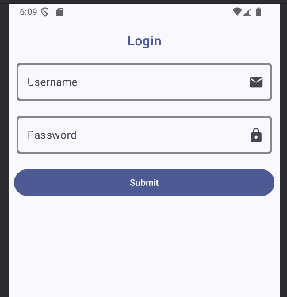
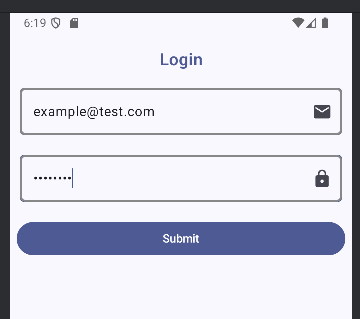

## Login form UI exercise

This is a very simple **Kotlin + Jetpack Compose** user interface of login form for Android app. 
Code contains inline comments to clarify UI layout and compose elements.

### Screenshots
<table>
<tr>
<td></td>
<td></td> 
<td></td>
</tr>
</table> 

### Description
This project implements a basic login screen layout with:
- Username (email) input field
- Password input field with hidden characters
- Submit button
- Error messages

The project doesn't implement authentication or backend logic. 
Basic UI-level validation is done to demonstrate error states (proper email type check and password not being empty). 
Pressing submit-button doesn't perform real login operation or redirect to another view, only displays error messages.

### Features
- `Column` layout to arrange elements vertically
- `OutlinedTextField` components with trailing icons (default mail and lock icons)
- Proper `keyboard types` for email and password (KeyboardOptions)
- Password masking using `PasswordVisualTransformation`
- Styling uses `modifiers` (padding, width, colors, borders)
- `isError` to define error states

### Running the app
This project was created using Android Studio.
To clone and open the project:
```
- git clone https://github.com/Anniina-55/Login-form.git
- cd login-form
- open the project in Android Studio

-> UI should render on emulator and physical devices

